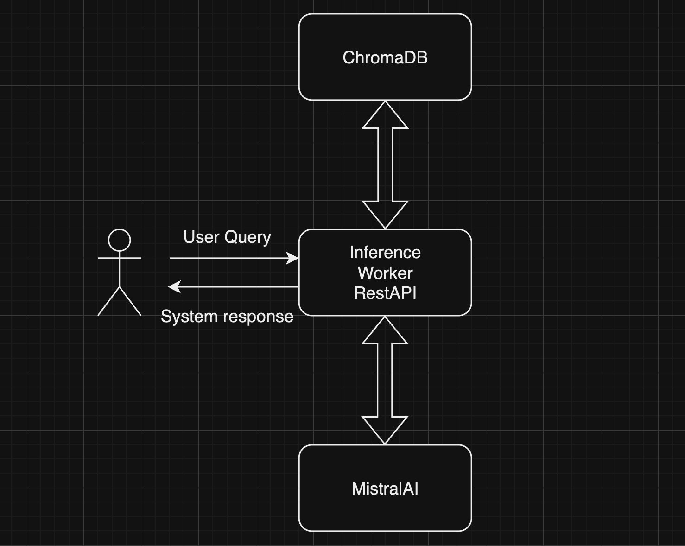
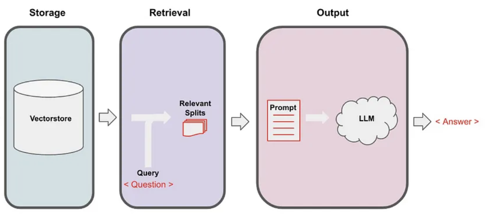
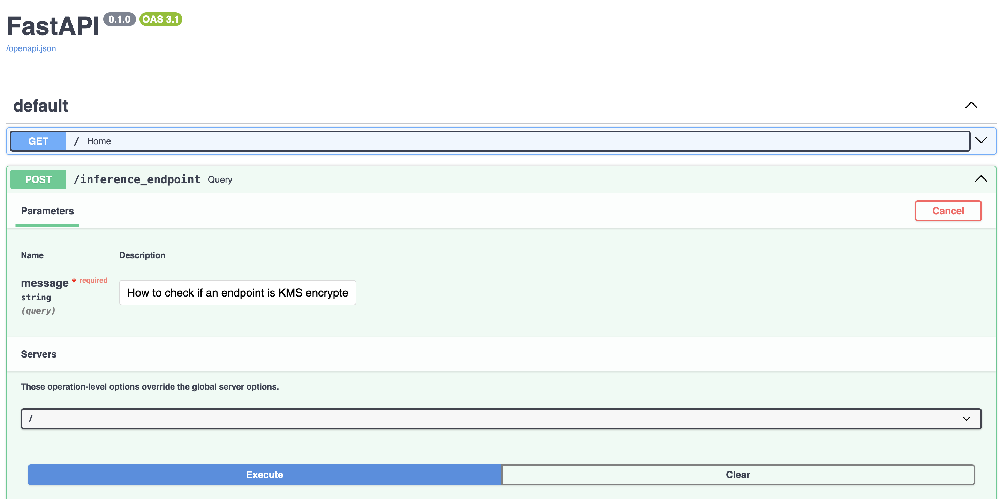

# Cloud based RAG for AWS SageMaker documentation

## Summary
This POC (Proof of concept) consist in a RAG (Retrieval Augmented Generation) system that is capable of:

1. Receive a user query, usually a question, about the relevant topic i.e. AWS SageMaker.
1. Return: 
    - An answer to the user question.
    - A list of reference documents from SageMaker documentation for further consulting.

> The main request (answer some questions about SageMaker) and also the optional (return reference documents from documentation) were implemented.

High level overview of the system architecture:




The system is composed of a vector database and an inference worker, both integrated as microservices. The inference worker is a rest API that communicates with the user and is responsable of quering the vector database and excecuting the LLM based pipeline to deliver the requested answer.


> Detailed overview of the inference pipeline.

The embedding extraction is made on a locally running model, in order to save some credits since this is project uses free models and the credits burn really fast if you want to encode the whole dataset.
The inference part is done using MistralAI, a third party API similar to OpenAI, so you need to go to [mistral.ai](https://mistral.ai/) and generate your free api key.

The key component here is [LangChain](https://python.langchain.com) package. LangChain is a framework that facilitate the integration of large language models into applications and also simplifies the data pre-processing steps such as embedding extraction.

The system output follows this schema:

```python
@dataclass
class LLMResponse:
    docs: Set[str]
    answer: str
```
> `answer` is the main answer from the system and `docs` is a set of document names that contain more detailed information about the asked topic.


## System setup

### Requirements
[Docker](https://docs.docker.com/manuals/) (thats all!)

## Embedding model download

Download the embeddings extraction model from [HERE](https://drive.google.com/drive/folders/1ZQaqmevV5jLVqxDzORn2IERBbrIdjhw1?usp=drive_link). And place it in the root this project.

### Database build

Since this is a demo based on opensource/free tools in order to speed up the excecution the documents must be parsed and the database must be built before the first excecution. 

Download the dataset from [HERE](https://drive.google.com/drive/folders/1NZ-TuNeBpf_KGlezX5Iy0p4Zk-rwW7MA?usp=drive_link)

To build the database run:
```sh
docker build . -t inference-worker -f  Dockerfile
```
And:
```sh
docker run --rm -v $(pwd):/app inference-worker  python ./utils/db_builder.py  -d dataset/sagemaker_documentation -db database/chroma
```

> NOTE: If you want to build the database yourself its recommended to use a linux
machine with an nvidia gpu. Follow [THIS](https://docs.nvidia.com/datacenter/cloud-native/container-toolkit/latest/install-guide.html) installation instructions and change the
command to:

```sh
docker run --rm --gpus all -v $(pwd):/app inference-worker  python ./utils/db_builder.py  -d dataset/sagemaker_documentation -db database/chroma
```

> You can also download the built database from [HERE](https://drive.google.com/drive/folders/1vJhVyXoGkj0840ALnCVoaurrfwaw-lUX?usp=drive_link)


After those steps the project folder structure should look like this:

```sh
.
├── all-mpnet-base-v2
│   └── models--sentence-transformers--all-mpnet-base-v2
├── database
│   └── chroma
├── dataset
│   └── sagemaker_documentation
├── images
├── inference_worker
└── utils
└── docker-compose.yml
└── Dockerfile
└── readme.md
└── requirements.txt
```

## Run the system

Create a `.env` file and place it in the root of this project.
Your `.env` should look like this:

```
MISTRAL_API_KEY={your mistral api key}
EMBEDDING_MODEL_PATH=./all-mpnet-base-v2
EMBEDDING_MODEL_NAME=sentence-transformers/all-mpnet-base-v2
INFERECE_MODEL=mistral-large-latest
```
Once the database is build place it in `/database` and run (from the root directory of this project):

```sh
docker compose -f ./docker-compose.yml up
```
> If you are using a machine that has nvidia GPU's you can use `docker compose -f ./docker-compose-gpu.yml up` 

this will bring the system up.

Once the system is up you can go to [http://localhost:80/docs](http://localhost:80/docs).



You can test the inference endpoint from there or try to use `curl`:

```sh
curl -X 'POST' \
  'http://localhost/inference_endpoint?message=How%20to%20check%20if%20an%20endpoint%20is%20KMS%20encrypted' \
  -H 'accept: application/json' \
  -d ''
```

Or test it from Postman. 

## Next Steps

1. Implement an endpoint to update/delete documents from the existing database. The current database has been setted up to use persistent volumes so the only modification needed is in the `inference_worker` service.
2. Evaluate and switch to a different model for embedding generation and inference. Probably OpenAI or another payed API will give faster and better results.
3. Add authentication to chromadb service.
4. Parametrize document loader to allow different document formats.
5. Move the pre built database to AWS S3 or GCP Cloud Storage. Use git lfs for the embedding model storage.
6. Use K8S for production deployment instead of docker compose.
